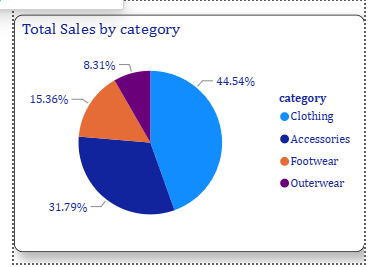

# 🛍️ Customer Behavior Analytics

An end-to-end **Customer Shopping Behavior Analysis** project using **Python, SQL, PostgreSQL, and Power BI** to uncover customer purchasing patterns, product performance, customer segmentation, and actionable business insights.

---

## 📌 Project Overview

Understanding customer purchasing behavior is essential for improving sales, customer retention, and marketing strategies.

This project analyzes customer shopping data to identify:

* Customer purchasing patterns
* High-value customer segments
* Product and category performance
* Subscription behavior
* Shipping preferences
* Revenue and sales trends
* Customer loyalty patterns
* Opportunities for improving customer engagement and retention

The project follows a complete analytics workflow:

**Raw Data → Data Cleaning → Exploratory Data Analysis → SQL Analysis → Power BI Dashboard → Business Insights**

---

## 🎯 Business Problem

The business wants to better understand its customers and determine:

* Which customer segments generate the most revenue?
* Which products and categories perform best?
* Do subscribed customers spend more than non-subscribers?
* How does shipping preference affect customer spending?
* Which age groups contribute the most revenue?
* What percentage of customers are new, returning, and loyal?
* How can customer behavior insights support better business decisions?

---

## 🛠️ Tools & Technologies

| Tool                | Purpose                               |
| ------------------- | ------------------------------------- |
| 🐍 Python           | Data cleaning, preprocessing & EDA    |
| 🐼 Pandas           | Data manipulation and analysis        |
| 🔢 NumPy            | Numerical operations                  |
| 🗄️ PostgreSQL      | SQL-based business analysis           |
| 📊 Power BI         | Interactive dashboard & visualization |
| 📈 DAX              | KPI calculations and business metrics |
| 📓 Jupyter Notebook | Python analysis                       |
| 📁 CSV              | Source dataset                        |

---

## 🔄 Project Workflow

```text
                    Raw Customer Data
                           │
                           ▼
                  Data Cleaning & EDA
                       (Python)
                           │
                           ▼
                  Data Transformation
                           │
                           ▼
                  Business Analysis
                     (PostgreSQL)
                           │
                           ▼
                 KPI & DAX Development
                      (Power BI)
                           │
                           ▼
                Interactive Dashboard
                           │
                           ▼
                Business Insights
                     & Recommendations
```

---

# 🐍 1. Python Data Analysis

Python was used to prepare and explore the customer shopping dataset.

### Key Activities

* Loaded and inspected the dataset
* Checked data types and dataset structure
* Identified missing values
* Cleaned and transformed data
* Performed exploratory data analysis
* Analyzed customer demographics
* Examined purchasing behavior
* Compared subscriber and non-subscriber customers
* Analyzed product and category performance
* Created insights for dashboard development

### Libraries Used

```python
import pandas as pd
import numpy as np
import matplotlib.pyplot as plt
```

---

# 🗄️ 2. SQL Analysis

PostgreSQL was used to perform business-focused analysis and answer important analytical questions.

### SQL Concepts Used

* SELECT
* WHERE
* GROUP BY
* ORDER BY
* JOIN
* CASE WHEN
* Aggregate Functions
* Subqueries
* Common Table Expressions (CTEs)
* Window Functions

### Example Business Questions

```sql
-- Revenue by category

SELECT
    category,
    SUM(purchase_amount) AS total_revenue
FROM customer_shopping_behavior
GROUP BY category
ORDER BY total_revenue DESC;
```

```sql
-- Subscriber vs Non-Subscriber spending

SELECT
    subscription_status,
    COUNT(*) AS customers,
    AVG(purchase_amount) AS avg_purchase
FROM customer_shopping_behavior
GROUP BY subscription_status;
```

SQL analysis helped transform raw transactional data into business-ready insights.

---

# 📊 3. Power BI Dashboard

The cleaned and analyzed data was used to create an interactive Power BI dashboard.

### Dashboard Pages

### 🏠 Customer Behavior Analytics

Provides a high-level overview of:

* Total Revenue
* Total Sales
* Average Purchase Amount
* Customer distribution
* Category performance
* Age-group analysis
* Subscription behavior

### 👥 Customer Insights

Focuses on customer-level behavior including:

* Customer segmentation
* Subscription analysis
* Customer demographics
* Spending patterns
* Customer loyalty
* Purchase behavior

### 📦 Product & Operations

Analyzes:

* Product performance
* Category contribution
* Shipping preferences
* Revenue by product/category
* Operational trends

### 🔎 Product Tooltip

An interactive tooltip provides additional product-level information when users hover over dashboard visuals.

---

# 📈 Key KPIs

The dashboard focuses on important business metrics such as:

| KPI                  | Purpose                                |
| -------------------- | -------------------------------------- |
| 💰 Total Revenue     | Measures overall revenue generated     |
| 🛒 Total Sales       | Measures transaction volume            |
| 💵 Average Purchase  | Measures average customer spending     |
| 👥 Total Customers   | Measures customer base                 |
| ⭐ Average Rating     | Measures product/customer satisfaction |
| 🔄 Subscription Rate | Measures subscription adoption         |

---

# 💡 Key Business Insights

The analysis identified several important customer behavior patterns:

### 1. Subscription Behavior

Subscribed customers demonstrated significantly higher purchasing activity compared with non-subscribers.

**Business implication:**
The company should focus on increasing subscription adoption through targeted offers, loyalty benefits, and personalized campaigns.

---

### 2. Customer Segmentation

Customers can be categorized into:

* **New Customers**
* **Returning Customers**
* **Loyal Customers**

This segmentation helps identify customers who require acquisition, engagement, or retention strategies.

---

### 3. Shipping Behavior

Different shipping preferences are associated with different spending patterns.

**Business implication:**
The company can use shipping preferences to design targeted promotions and premium delivery offers.

---

### 4. Product & Category Performance

Revenue and sales vary across product categories.

**Business implication:**
High-performing categories can receive greater promotional focus, while underperforming categories can be reviewed for pricing, discounts, and product positioning.

---

# 🎯 Business Recommendations

Based on the analysis, the following strategies can help improve business performance:

### 📌 Increase Subscription Adoption

Offer exclusive discounts, rewards, and personalized benefits to encourage non-subscribers to subscribe.

### 📌 Focus on High-Value Customers

Create loyalty programs and personalized campaigns for returning and loyal customers.

### 📌 Optimize Product Strategy

Invest more in high-performing products and analyze low-performing categories for improvement opportunities.

### 📌 Personalize Marketing

Use customer demographics, purchasing history, and spending behavior to create targeted marketing campaigns.

### 📌 Improve Customer Retention

Identify valuable returning customers and provide personalized offers to increase repeat purchases.

---

# 🖼️ Dashboard Preview

## Customer Behavior Analytics


---

## Customer Insights


---

## Product & Operations


---

## Product Tooltip



---

# 📂 Repository Structure

```text
Customer_Behavior_Analytics/
│
├── 📊 Customer_Behavior_Analytics.pbix
│
├── 🐍 Customer_Shopping_Behavior_Analysis.ipynb
│
├── 🗄️ customer_behavior_sql_queries.sql
│
├── 📁 customer_shopping_behavior.csv
│
├── 🖼️ Customer behavior analytics.png
│
├── 🖼️ Customer insights.png
│
├── 🖼️ Product and operations.png
│
├── 🖼️ tooltip.png
│
├── 📑 Customer-Shopping-Behavior-Analysis.pptx
│
└── 📄 README.md
```

---

# 🚀 How to Use This Project

### 1️⃣ Clone the Repository

```bash
git clone https://github.com/Sonamwalekar-anly/Customer_Behavior_Analytics.git
```

### 2️⃣ Explore Python Analysis

Open:

```text
Customer_Shopping_Behavior_Analysis.ipynb
```

Run the notebook to explore the data cleaning and exploratory analysis process.

### 3️⃣ Run SQL Analysis

Open:

```text
customer_behavior_sql_queries.sql
```

Execute the queries in PostgreSQL to reproduce the business analysis.

### 4️⃣ Explore Power BI Dashboard

Open:

```text
Customer_Behavior_Analytics.pbix
```

Use the slicers, visuals, KPIs, and tooltips to interact with the dashboard.

---

# 📚 Skills Demonstrated

### Data Analytics

* Data Cleaning
* Data Transformation
* Exploratory Data Analysis
* Customer Segmentation
* Business Analysis
* KPI Development
* Data Visualization

### Technical Skills

* Python
* Pandas
* NumPy
* SQL
* PostgreSQL
* Power BI
* DAX
* Data Modeling
* Dashboard Development

### Business Skills

* Customer Behavior Analysis
* Sales Analysis
* Product Performance Analysis
* Customer Retention
* Subscription Analysis
* Business Recommendations
* Data-Driven Decision Making

---

# 📌 Project Deliverables

This repository includes:

✅ Python EDA Notebook
✅ SQL Business Analysis Queries
✅ Power BI Interactive Dashboard
✅ Customer Shopping Dataset
✅ Dashboard Screenshots
✅ Project Presentation

---

# 👩‍💻 Author

**Sonam S Walekar**

Aspiring **Data Analyst** skilled in Python, SQL, Power BI, Excel, and Tableau.

### 🔗 Connect With Me

* GitHub: [Sonamwalekar-anly](https://github.com/Sonamwalekar-anly)

---

⭐ If you find this project useful, consider giving the repository a star!
